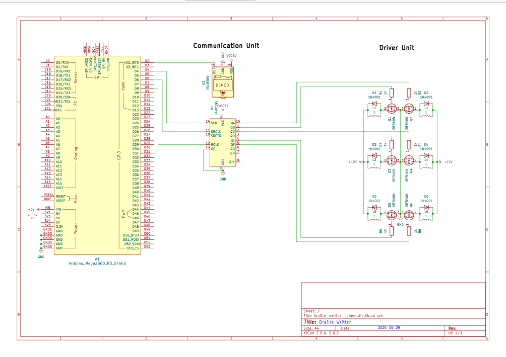
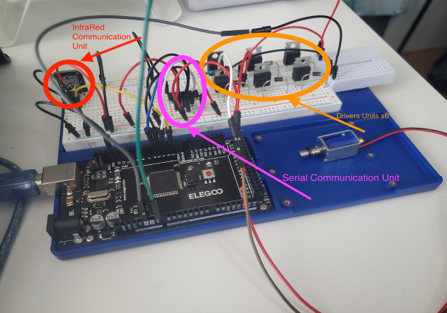

# Barille Writter 

This library was created for a project for the course EECS2032. The project is about creating a braille writer device, which can receive and read English text, and translate it to the American braille language, using solenoids and a custom driver circuit to mimic bumps and dots of the braille language.

NOTE: Create an IRdecoder file in Arduino/libraries and add IRdecoder.h and IRdecoder.cpp to it
This branch attempts to improve the input system by using interrupts

The sketch that should be uploaded to an Arduino to mimic the final functionality is the translation.ino file.
All files in the translation folder must be in the same directory.

The demo video can be seen at this link https://www.youtube.com/watch?v=A-jqoaMqUTU.

# Circuit Schematic
- Check the [NOTICE.md](./NOTICE.md) for references to external schematic symbols used, under public licenses.

# Video Demo

# Documentation
- A report containing the hardware design, functionality, simulations and overall calculations can be found here [Calculations Report](Reports/calculations_report.pdf) (for course EECS2210).
- A report containing the software design, implementation and code explanation can be found here [System Report](Reports/system_report.pdf) (for course EECS2032).

## 🛠️ Technologies & Tools
  

  
  
  

  

  

- Developed a custom **Arduino C++ library** to encapsulate the control logic for a circuit driver  
- Employed **Git CLI** and **Arduino CLI** for streamlined development and automation 
- Edited and tested code in **Vim/Neovim**, using serial monitor tools for debugging

## 🧱 Hardware Platform
- 🔌 **Microcontroller:** [Arduino Mega 2560](https://store.arduino.cc/products/arduino-mega-2560-rev3) (ATmega2560)  
- ⚙️ **Circuit Driver:** Custom actuator control circuit  
- 🧩 **Interface:** Digital I/O for control signaling and feedback  

## Credits

Special thanks to:

- **Alarm Siren** for the [arduino-kicad-library](https://github.com/Alarm-Siren/arduino-kicad-library) project, where the Arduino_Mega2560_R3_Shield kicad symbol (ArduinoMega) was used in the schematic.

- **Andres Garcia Alves** for the [electronics-kicad-custom-simbols](https://github.com/andres-garcia-alves/electronics-kicad-custom-simbols) project, where the VS1838B kicad symbol (InfraRed sensor) was used in the schematic. 

## License

